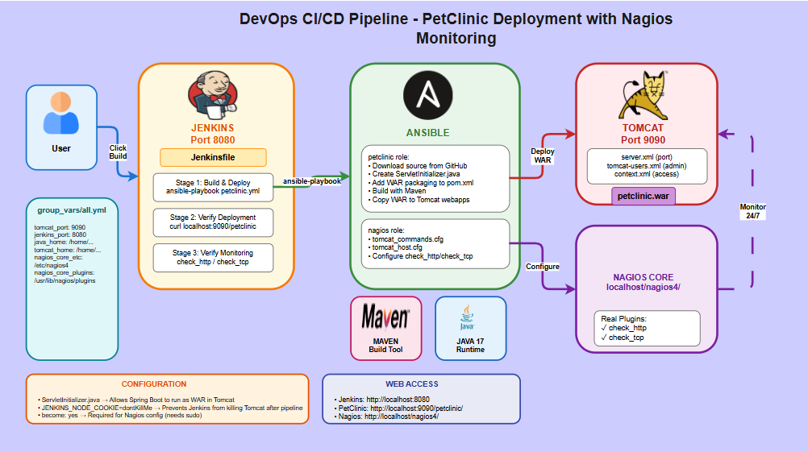

# DevOps CI/CD Pipeline - PetClinic Deployment with Nagios Monitoring

## Architecture Diagram



---

## Project Overview

This project implements a complete **CI/CD pipeline** that automatically builds, deploys, and monitors the **Spring PetClinic** application using:

| Tool | Purpose | Port |
|------|---------|------|
| **Jenkins** | CI/CD automation | 8080 |
| **Ansible** | Configuration management | - |
| **Tomcat** | Application server | 9090 |
| **Nagios Core** | Real-time monitoring | 80 (/nagios4/) |
| **Maven** | Build tool | - |
| **Java 17** | Runtime environment | - |

---

## Table of Contents

1. [Prerequisites](#prerequisites)
2. [Project Structure](#project-structure)
3. [Quick Start](#quick-start)
4. [Detailed Installation](#detailed-installation)
5. [How It Works](#how-it-works)
6. [Configuration Reference](#configuration-reference)
7. [User Manual](#user-manual)
8. [Troubleshooting](#troubleshooting)

---

## Prerequisites

Before starting, ensure you have:

- Linux-based operating system (Ubuntu/Debian recommended)
- `sudo` access for initial setup
- Internet connection to download dependencies

### Required Packages (One-time setup)

```bash
# Install Ansible
sudo apt update
sudo apt install ansible -y

# Install Nagios Core (required for real monitoring)
sudo apt install nagios4 nagios-plugins -y
```

---

## Project Structure

```
task-02/
├── README.md                          # This file
├── Jenkinsfile                        # CI/CD Pipeline definition
├── diagram.drawio                     # Architecture diagram (draw.io)
├── diagram.png                        # Architecture diagram (exported)
├── scripts/
│   └── build.sh                       # Maven build script
└── ansible/
    ├── ansible.cfg                    # Ansible configuration
    ├── inventory/
    │   └── hosts                      # Inventory (localhost)
    ├── group_vars/
    │   └── all.yml                    # ★ All variables defined here
    ├── tomcat.yml                     # Tomcat installation playbook
    ├── jenkins.yml                    # Jenkins installation playbook
    ├── nagios.yml                     # Nagios configuration playbook
    ├── petclinic.yml                  # Build & deploy playbook
    └── roles/
        ├── tomcat/                    # Tomcat role
        │   ├── tasks/main.yml
        │   └── templates/
        │       ├── server.xml.j2      # ★ Port configuration
        │       ├── tomcat-users.xml.j2 # ★ Admin credentials
        │       ├── context.xml.j2     # Manager access
        │       ├── start.sh.j2
        │       └── stop.sh.j2
        ├── jenkins/                   # Jenkins role
        │   ├── tasks/main.yml
        │   └── templates/
        │       ├── start.sh.j2
        │       └── stop.sh.j2
        ├── petclinic/                 # PetClinic role
        │   ├── tasks/main.yml         # ★ ServletInitializer creation
        │   └── handlers/main.yml      # ★ JENKINS_NODE_COOKIE
        └── nagios/                    # Nagios role
            ├── tasks/main.yml
            ├── handlers/main.yml
            └── templates/
                ├── tomcat_commands.cfg.j2  # ★ Real Nagios commands
                └── tomcat_host.cfg.j2      # ★ Services definition
```

---

## Quick Start

### Option 1: Run Full Pipeline via Jenkins

```bash
# 1. Start Jenkins
/home/amal/devops/jenkins/start.sh

# 2. Open Jenkins in browser
# http://localhost:8080

# 3. Create pipeline job pointing to Jenkinsfile

# 4. Click "Build Now"
```

### Option 2: Run Manually with Ansible

```bash
cd /home/amal/task-02/ansible

# Step 1: Install Tomcat
ansible-playbook tomcat.yml

# Step 2: Build and deploy PetClinic
ansible-playbook petclinic.yml

# Step 3: Configure Nagios monitoring
ansible-playbook nagios.yml --ask-become-pass
```

---

## Detailed Installation

### Step 1: Install Tomcat

```bash
cd /home/amal/task-02/ansible
ansible-playbook tomcat.yml
```

**What it does:**
- Downloads Apache Tomcat 10.1.18
- Configures port **9090** (in `server.xml`)
- Creates admin user **admin/admin123** (in `tomcat-users.xml`)
- Enables manager access (in `context.xml`)
- Creates start/stop scripts

**Verify:**
```bash
/home/amal/devops/tomcat/bin/startup.sh
curl http://localhost:9090
# Should return Tomcat welcome page
```

### Step 2: Install Jenkins

```bash
ansible-playbook jenkins.yml
```

**What it does:**
- Downloads Jenkins WAR file (v2.440.1)
- Configures port **8080**
- Creates start/stop scripts

**Verify:**
```bash
/home/amal/devops/jenkins/start.sh
# Wait 30 seconds for startup
curl http://localhost:8080
```

**Get initial admin password:**
```bash
cat /home/amal/devops/jenkins/data/secrets/initialAdminPassword
```

### Step 3: Build and Deploy PetClinic

```bash
ansible-playbook petclinic.yml
```

**What it does:**
1. Downloads PetClinic source from GitHub
2. Downloads Maven 3.9.6
3. Creates `ServletInitializer.java` (required for WAR deployment)
4. Adds `<packaging>war</packaging>` to pom.xml
5. Builds WAR file using Maven
6. Copies WAR to Tomcat webapps
7. Restarts Tomcat
8. Verifies deployment with HTTP check

**Verify:**
```bash
curl http://localhost:9090/petclinic/
# Should return PetClinic homepage with "Welcome"
```

### Step 4: Configure Nagios Monitoring

```bash
ansible-playbook nagios.yml --ask-become-pass
```

**What it does:**
1. Creates `tomcat_commands.cfg` with real Nagios plugins:
   - `check_http` - HTTP response check
   - `check_tcp` - TCP port check
2. Creates `tomcat_host.cfg` with 4 services:
   - Tomcat HTTP
   - Tomcat TCP Port
   - PetClinic Application
   - Tomcat Manager
3. Adds config files to `/etc/nagios4/nagios.cfg`
4. Restarts Nagios Core daemon

**Verify:**
```bash
# Check Nagios is running
sudo systemctl status nagios4

# Test real Nagios plugins manually
/usr/lib/nagios/plugins/check_http -H 127.0.0.1 -p 9090
/usr/lib/nagios/plugins/check_tcp -H 127.0.0.1 -p 9090

# Open Nagios Web UI
# http://localhost/nagios4/
# Username: nagiosadmin
```

---

## How It Works

### Pipeline Flow

```
┌─────────────┐     ┌─────────────┐     ┌─────────────┐     ┌─────────────┐
│  Developer  │────→│   JENKINS   │────→│   ANSIBLE   │────→│   TOMCAT    │
│             │     │  Port 8080  │     │   Roles     │     │  Port 9090  │
└─────────────┘     └─────────────┘     └─────────────┘     └─────────────┘
   Click Build         Jenkinsfile        petclinic.yml       petclinic.war
                                                                   ↑
                                                              Monitor 24/7
                                                                   │
                                                           ┌─────────────┐
                                                           │   NAGIOS    │
                                                           │    Core     │
                                                           └─────────────┘
```

### Jenkinsfile Stages

| Stage | Description | Command |
|-------|-------------|---------|
| **Build & Deploy** | Runs Ansible to build and deploy | `ansible-playbook petclinic.yml` |
| **Verify Deployment** | Checks PetClinic is accessible | `curl localhost:9090/petclinic/` |
| **Verify Monitoring** | Tests Nagios plugins | `check_http`, `check_tcp` |

### Critical Configurations

#### 1. ServletInitializer.java

Spring Boot normally runs as JAR with embedded server. To run in Tomcat (WAR), we need:

```java
public class ServletInitializer extends SpringBootServletInitializer {
    @Override
    protected SpringApplicationBuilder configure(SpringApplicationBuilder application) {
        return application.sources(PetClinicApplication.class);
    }
}
```

**Location:** Created by `petclinic/tasks/main.yml`

#### 2. JENKINS_NODE_COOKIE

Jenkins kills child processes after pipeline ends. To keep Tomcat running:

```bash
export JENKINS_NODE_COOKIE=dontKillMe
```

**Location:** `petclinic/handlers/main.yml`

#### 3. Real Nagios Plugins

We use built-in Nagios plugins (NOT custom scripts):

```bash
# Check HTTP response
/usr/lib/nagios/plugins/check_http -H 127.0.0.1 -p 9090

# Check TCP port
/usr/lib/nagios/plugins/check_tcp -H 127.0.0.1 -p 9090

# Check PetClinic with content
/usr/lib/nagios/plugins/check_http -H 127.0.0.1 -p 9090 -u /petclinic/ -s "Welcome"
```

---

## Configuration Reference

### group_vars/all.yml

All variables are centralized here:

| Variable | Value | Description |
|----------|-------|-------------|
| `tomcat_port` | 9090 | Tomcat HTTP port |
| `jenkins_port` | 8080 | Jenkins HTTP port |
| `tomcat_manager_user` | admin | Tomcat manager username |
| `tomcat_manager_password` | admin123 | Tomcat manager password |
| `java_home` | /home/pet-clinic/java/jdk-17.0.9 | Java installation |
| `nagios_core_etc` | /etc/nagios4 | Nagios config directory |
| `nagios_core_plugins` | /usr/lib/nagios/plugins | Nagios plugins directory |

### Tomcat Templates

| Template | Purpose |
|----------|---------|
| `server.xml.j2` | Sets port to `{{ tomcat_port }}` (9090) |
| `tomcat-users.xml.j2` | Creates admin user with manager roles |
| `context.xml.j2` | Removes IP restriction for manager access |

### Nagios Templates

| Template | Purpose |
|----------|---------|
| `tomcat_commands.cfg.j2` | Defines HOW to check (which plugins) |
| `tomcat_host.cfg.j2` | Defines WHAT to monitor (services) |

---

## User Manual

### Starting Services

```bash
# Start Tomcat
/home/amal/devops/tomcat/bin/startup.sh

# Start Jenkins
/home/amal/devops/jenkins/start.sh

# Nagios Core (runs as system service)
sudo systemctl start nagios4
```

### Stopping Services

```bash
# Stop Tomcat
/home/amal/devops/tomcat/bin/shutdown.sh

# Stop Jenkins
/home/amal/devops/jenkins/stop.sh

# Stop Nagios
sudo systemctl stop nagios4
```

### Web Access URLs

| Application | URL | Credentials |
|-------------|-----|-------------|
| **PetClinic** | http://localhost:9090/petclinic/ | None |
| **Tomcat Manager** | http://localhost:9090/manager/html | admin / admin123 |
| **Jenkins** | http://localhost:8080 | See initial password |
| **Nagios Core** | http://localhost/nagios4/ | nagiosadmin |

### Running the Jenkins Pipeline

1. Open http://localhost:8080
2. Create new **Pipeline** job
3. Configure:
   - **Definition:** Pipeline script from SCM
   - **SCM:** Git
   - **Repository URL:** /home/amal/task-02 (or your git URL)
   - **Script Path:** Jenkinsfile
4. Click **Save**
5. Click **Build Now**

### Checking Nagios Monitoring Status

**Web UI:**
1. Go to http://localhost/nagios4/
2. Click **Services** in left menu
3. Look for `tomcat-server` host with 4 services:
   - Tomcat HTTP → OK
   - Tomcat TCP Port → OK
   - PetClinic Application → OK
   - Tomcat Manager → OK

**Command Line:**
```bash
# Check all services status
/usr/lib/nagios/plugins/check_http -H 127.0.0.1 -p 9090
# Expected: HTTP OK: HTTP/1.1 200 OK

/usr/lib/nagios/plugins/check_tcp -H 127.0.0.1 -p 9090
# Expected: TCP OK - 0.001 second response time

/usr/lib/nagios/plugins/check_http -H 127.0.0.1 -p 9090 -u /petclinic/ -s "Welcome"
# Expected: HTTP OK: HTTP/1.1 200 OK - contains "Welcome"
```

### Monitoring Behavior

- **Check Interval:** Every 1 minute
- **Max Attempts:** 3 (before CRITICAL)
- **Notification:** Every 30 minutes if problem persists

**Test monitoring by stopping Tomcat:**
```bash
/home/amal/devops/tomcat/bin/shutdown.sh
# Wait 1-2 minutes
# Check Nagios UI - services should show CRITICAL
```

---

## Troubleshooting

### PetClinic not accessible

```bash
# Check Tomcat is running
ps aux | grep tomcat

# Check Tomcat logs
tail -50 /home/amal/devops/tomcat/logs/catalina.out

# Check WAR file exists
ls -la /home/amal/devops/tomcat/webapps/petclinic.war
```

### Jenkins pipeline fails at "Configure Monitoring"

The Nagios playbook requires sudo. Either:

1. Run Nagios playbook manually:
```bash
ansible-playbook nagios.yml --ask-become-pass
```

2. Or configure passwordless sudo for Jenkins:
```bash
sudo bash -c 'echo "jenkins ALL=(ALL) NOPASSWD: ALL" > /etc/sudoers.d/jenkins'
```

### Nagios shows UNKNOWN status

Check the command configuration:
```bash
sudo /usr/sbin/nagios4 -v /etc/nagios4/nagios.cfg
```

If errors, check config files:
```bash
cat /etc/nagios4/objects/tomcat_commands.cfg
cat /etc/nagios4/objects/tomcat_host.cfg
```

### Tomcat stops after Jenkins pipeline

Ensure `JENKINS_NODE_COOKIE=dontKillMe` is in the handler:
```bash
cat /home/amal/task-02/ansible/roles/petclinic/handlers/main.yml
```

### Build fails with Java error

```bash
# Verify Java version
$JAVA_HOME/bin/java -version
# Should be 17.x

# Verify Maven
/home/amal/devops/maven/bin/mvn -version
```

---

## Task Requirements Checklist

| Requirement | Status | Implementation |
|-------------|--------|----------------|
| Install Ansible using package manager | ✅ | `sudo apt install ansible` |
| Install Tomcat using Ansible | ✅ | `ansible/tomcat.yml` |
| Configure Tomcat deployment manager | ✅ | `tomcat-users.xml.j2`, `context.xml.j2` |
| Install Nagios using Ansible | ✅ | `ansible/nagios.yml` (configures Nagios Core) |
| Install Jenkins using Ansible | ✅ | `ansible/jenkins.yml` |
| Build PetClinic using shell script | ✅ | `scripts/build.sh` |
| Deploy PetClinic using Ansible | ✅ | `ansible/petclinic.yml` |
| Automated sanity checks | ✅ | HTTP check in playbook + Jenkinsfile |
| Nagios monitors Tomcat | ✅ | Real `check_http`, `check_tcp` plugins |
| Application on port 9090 | ✅ | Configured in `group_vars/all.yml` |
| Jenkinsfile for CI/CD | ✅ | `Jenkinsfile` with 3 stages |
| No package managers (except Ansible) | ✅ | All tools downloaded as archives |

